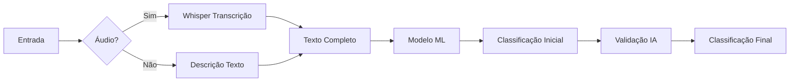

# 🔍 Deviation Classifier API

API backend em Python para classificação inteligente de desvios e incidentes usando Machine Learning e IA generativa.

## 📋 Visão Geral

Esta aplicação foi desenvolvida para auxiliar agentes de segurança e equipes de operação a classificar, priorizar e direcionar desvios/incidentes de forma automatizada e inteligente.

### Contexto de Negócio

**Agente de Segurança** - Profissional responsável por:
- Analisar reportes de desvios e incidentes
- Classificar gravidade, urgência e tendência
- Direcionar para a área/equipe responsável
- Garantir resposta rápida em situações críticas

### Fluxo de Classificação



## 🏗️ Arquitetura

### Princípios de Design
- **Clean Code**: Código limpo, legível e autodocumentado
- **SOLID**: Princípios de design orientado a objetos
- **DRY**: Don't Repeat Yourself
- **Separation of Concerns**: Services especializadas

### Estrutura do Projeto
```
deviation-classifier-api/
├── app/
│   ├── models/              # Schemas e Enums
│   │   ├── enums.py         # Tipos, Categorias, Direcionamentos
│   │   └── schemas.py       # DeviationClassification, ClassificationRequest
│   ├── services/            # Lógica de negócio
│   │   ├── transcription_service.py      # Whisper
│   │   ├── ml_model_service.py           # Modelo ML
│   │   ├── ai_validation_service.py      # Abacus.AI
│   │   └── deviation_classification_service.py  # Orquestrador
│   ├── routes/              # Controllers/Endpoints
│   │   └── deviation_routes.py
│   └── utils/               # Utilitários
│       ├── exceptions.py    # Exceções customizadas
│       └── logger.py        # Logging
├── tests/                   # Testes unitários
├── models_data/             # Modelo ML (.pkl)
├── app.py                   # Aplicação Flask
├── requirements.txt         # Dependências
├── Dockerfile              # Container Docker
└── README.md               # Esta documentação
```

## 🚀 Instalação

### Pré-requisitos
- Python 3.11+
- FFmpeg (para Whisper)
- 4GB+ RAM (modelo Whisper medium)

### Método 1: Instalação Local

```bash
# Clone o repositório
git clone <repo-url>
cd deviation-classifier-api

# Crie ambiente virtual
python -m venv venv
source venv/bin/activate  # Linux/Mac
# ou
venv\Scripts\activate  # Windows

# Instale dependências
pip install -r requirements.txt

# Configure variáveis de ambiente
cp .env.example .env
# Edite .env e adicione sua ABACUS_API_KEY

# Execute a aplicação
python app.py
```

### Método 2: Docker

```bash
# Build da imagem
docker build -t deviation-classifier-api .

# Execute o container
docker run -p 8000:8000 \
  -e ABACUS_API_KEY=your_key_here \
  deviation-classifier-api
```

### Método 3: Docker Compose

```bash
# Configure .env com ABACUS_API_KEY
cp .env.example .env

# Inicie os serviços
docker-compose up -d

# Visualize logs
docker-compose logs -f
```

## 📡 Endpoints da API

### 1. Health Check

Verifica status da aplicação e serviços.

**Request:**
```http
GET /health
```

**Response (200 OK):**
```json
{
  "status": "healthy",
  "services": {
    "transcription_service": true,
    "ml_service": true,
    "ai_validation_service": true
  }
}
```

### 2. Classificar Desvio

Classifica um desvio baseado em descrição e/ou áudio.

**Request:**
```http
POST /api/classify-deviation
Content-Type: application/json

{
  "local": "Setor 3 - Área de Produção",
  "description": "Equipamento danificado com risco de acidente",
  "audio": "<base64_encoded_mp3>"  // opcional
}
```

**Campos:**
- `local` (string, obrigatório): Local onde ocorreu o desvio
- `description` (string, opcional): Descrição textual do desvio
- `audio` (string base64, opcional): Áudio em MP3 codificado em base64

**Response (200 OK):**
```json
{
  "gravidade": 0.75,
  "urgencia": 0.85,
  "tendencia": 0.60,
  "tipo": "seguranca",
  "direcionamento": "supervisao_urgente",
  "categoria": "alto"
}
```

**Response (400 Bad Request):**
```json
{
  "error": "InvalidInputError",
  "message": "Campo 'local' é obrigatório",
  "details": {}
}
```

### 3. Classificar com Form Data

Também suporta multipart/form-data para upload de arquivo de áudio.

**Request:**
```http
POST /api/classify-deviation
Content-Type: multipart/form-data

local: Setor 3
description: Equipamento danificado
audio: <arquivo.mp3>
```

## 🎯 Campos de Classificação

### Gravidade (0.0 - 1.0)
Severidade do problema:
- **0.0 - 0.2**: Observação leve
- **0.2 - 0.4**: Problema menor
- **0.4 - 0.6**: Problema moderado
- **0.6 - 0.8**: Problema grave
- **0.8 - 1.0**: Problema crítico

### Urgência (0.0 - 1.0)
Necessidade de resposta rápida:
- **0.0 - 0.3**: Pode aguardar
- **0.3 - 0.6**: Resposta em dias
- **0.6 - 0.8**: Resposta em horas
- **0.8 - 1.0**: Resposta imediata

### Tendência (0.0 - 1.0)
Probabilidade de recorrência/agravamento:
- **0.0 - 0.3**: Improvável recorrer
- **0.3 - 0.6**: Pode recorrer
- **0.6 - 0.8**: Provável recorrer
- **0.8 - 1.0**: Muito provável agravar

### Tipos de Desvio
- `seguranca`: Relacionado à segurança do trabalho
- `qualidade`: Problemas de qualidade
- `ambiental`: Impactos ambientais
- `operacional`: Processos operacionais
- `manutencao`: Necessidade de manutenção
- `equipamento`: Problemas em equipamentos
- `procedimento`: Não conformidade em procedimentos
- `comportamental`: Questões de conduta
- `documentacao`: Problemas documentais
- `infraestrutura`: Infraestrutura física

### Direcionamentos
- `emergencia_imediata`: Ação imediata necessária
- `supervisao_urgente`: Supervisor deve agir urgentemente
- `manutencao`: Equipe de manutenção
- `engenharia`: Departamento de engenharia
- `qualidade`: Controle de qualidade
- `seguranca_trabalho`: Segurança do trabalho
- `meio_ambiente`: Meio ambiente
- `recursos_humanos`: RH
- `operacao`: Operação
- `gestao_instalacao`: Gestão da instalação
- `documentacao_apenas`: Apenas documentar

### Categorias
- `critico`: Criticidade máxima
- `alto`: Alta prioridade
- `medio`: Prioridade média
- `baixo`: Baixa prioridade
- `observacao`: Apenas observação

## 🔧 Configuração

### Variáveis de Ambiente

Crie arquivo `.env` baseado em `.env.example`:

```bash
# Abacus.AI API Key (obrigatório para validação IA)
ABACUS_API_KEY=your_api_key_here

# Debug mode (desenvolvimento)
DEBUG=false

# Modelo Whisper (tiny, base, small, medium, large)
WHISPER_MODEL=medium
```

### Obter Chave Abacus.AI

1. Acesse [https://abacus.ai](https://abacus.ai)
2. Crie uma conta ou faça login
3. Navegue até API Keys
4. Gere uma nova chave
5. Adicione ao arquivo `.env`

## 🧪 Testes

### Executar Todos os Testes
```bash
pytest
```

### Com Cobertura
```bash
pytest --cov=app --cov-report=html
```

### Testes Específicos
```bash
# Apenas testes de models
pytest tests/test_models.py

# Apenas testes de routes
pytest tests/test_routes.py -v
```

## 🛠️ Desenvolvimento

### Criar Modelo ML Mock
```bash
python create_mock_model.py
```

### Executar em Modo Debug
```bash
# Local
export DEBUG=true
python app.py

# Docker
docker-compose up
```

### Hot Reload
O docker-compose está configurado com volumes para hot reload:
```bash
docker-compose up
# Edite arquivos em app/ e veja mudanças automaticamente
```

## 🔒 Segurança

### CORS
- Configurado para permitir qualquer origem (`*`)
- Para produção, configure origens específicas em `app.py`

### Tamanho de Upload
- Máximo: 50MB (configurável em `app.py`)
- Ajuste conforme necessário para áudios maiores

### Validação de Entrada
- Validação completa em `DeviationClassificationService`
- Exceções customizadas para erros específicos
- Sanitização de inputs

## 📊 Monitoramento

### Logs
- Console: Todos os logs importantes
- Arquivo: `logs/app.log` (rotativo, 10MB, 5 backups)

### Health Check
```bash
curl http://localhost:8000/health
```

### Métricas
Para produção, considere adicionar:
- Prometheus para métricas
- Sentry para error tracking
- ELK Stack para logs centralizados

## 🚀 Deploy em Produção

### Recomendações
1. **Usar WSGI Server**: Gunicorn ou uWSGI
2. **Reverse Proxy**: Nginx
3. **Orquestração**: Kubernetes ou Docker Swarm
4. **Escalabilidade**: Load balancer + múltiplas réplicas
5. **Monitoramento**: Prometheus + Grafana

### Exemplo com Gunicorn
```bash
pip install gunicorn

gunicorn -w 4 -b 0.0.0.0:8000 app:app
```

### Exemplo Nginx Config
```nginx
server {
    listen 80;
    server_name api.example.com;
    
    location / {
        proxy_pass http://localhost:8000;
        proxy_set_header Host $host;
        proxy_set_header X-Real-IP $remote_addr;
    }
}
```

## 🤝 Contribuindo

1. Fork o projeto
2. Crie uma branch para sua feature (`git checkout -b feature/amazing`)
3. Commit suas mudanças (`git commit -m 'Add amazing feature'`)
4. Push para a branch (`git push origin feature/amazing`)
5. Abra um Pull Request

### Padrões de Código
- PEP 8 para Python
- Type hints sempre que possível
- Docstrings em todas as funções
- Testes para novas features

## 📝 Changelog

### v1.0.0 (2024-10-23)
- ✅ Implementação inicial completa
- ✅ Transcrição com Whisper
- ✅ Classificação com modelo ML
- ✅ Validação com Abacus.AI
- ✅ Endpoints REST
- ✅ Testes unitários
- ✅ Dockerização
- ✅ Documentação completa

## 📄 Licença

[Especifique a licença do projeto]

## 👥 Autores

[Seus créditos aqui]

## 🆘 Suporte

Para problemas ou dúvidas:
- Abra uma issue no GitHub
- Entre em contato: [seu-email@example.com]

## 🙏 Agradecimentos

- OpenAI Whisper pela transcrição de áudio
- Abacus.AI pela validação com IA
- Flask pela framework web
- Comunidade Python

---

**Desenvolvido com ❤️ para tornar a classificação de desvios mais inteligente e eficiente.**
